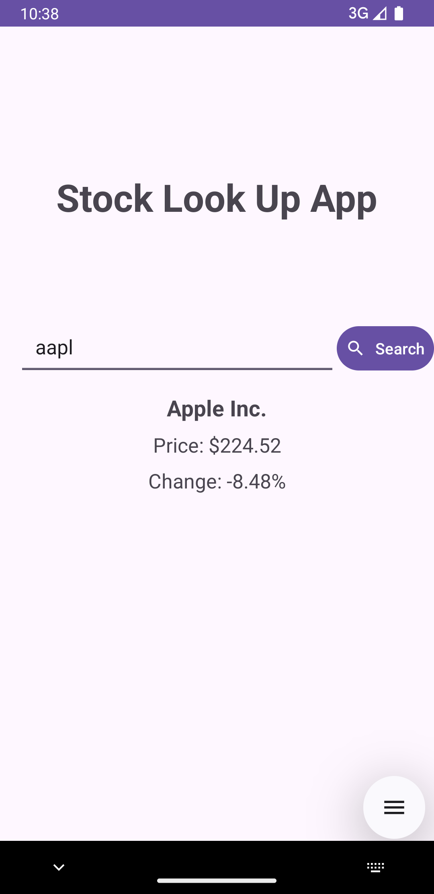
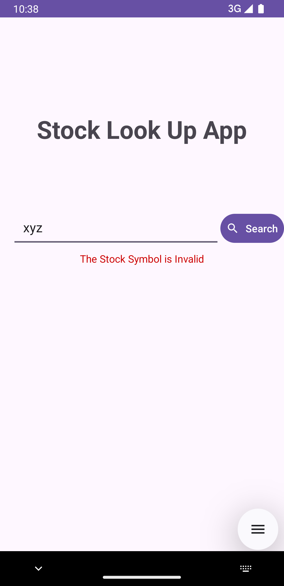

# Stock Lookup App

A simple Android app that allows users to search for a stock symbol and view its current price, percentage change, and company name using the Financial Modeling Prep API.

## Features

- **Search Bar**: Input for stock symbols (e.g., AAPL, TSLA).
- **Stock Information**: Displays the stock's current price, percentage change, and company name.
- **Loading Indicator**: Shows a loading spinner while fetching data.
- **Error Handling**: Displays appropriate error messages for invalid stock symbols or network issues.
- **Simple UI**: Clean, minimalistic UI with a gradient background.

## Technologies Used

- **Kotlin**: The app is built using Kotlin for Android.
- **ViewModel**: Separates UI from business logic.
- **Retrofit**: Handles API requests to fetch stock data.
- **ConstraintLayout**: For responsive UI design.
- **Financial Modeling Prep API**: Fetches real-time stock data.

## Screenshots
 <br>
 


## Installation

1. Clone the repository:

    ```bash
    git clone https://github.com/yourusername/StockLookupApp.git
    ```

2. Open the project in **Android Studio**.

3. Make a `secrets.xml` file in the res/values directory and put your API key there:

    ```
    <resources>
    <string name="api_key">your_api_key</string>
    </resources>
    ```

4. Run the application on an Android device or emulator.

## API Integration

This app uses the [Financial Modeling Prep API](https://financialmodelingprep.com/developer/docs/) to retrieve stock market data. You need to sign up and get an API key.

In `StockApi.kt`, the API key is passed as a query parameter:

```kotlin
@GET("quote/{symbol}")
suspend fun getStockData(
    @Path("symbol") symbol: String,
    @Query("apikey") apiKey: String 
): StockResponse
